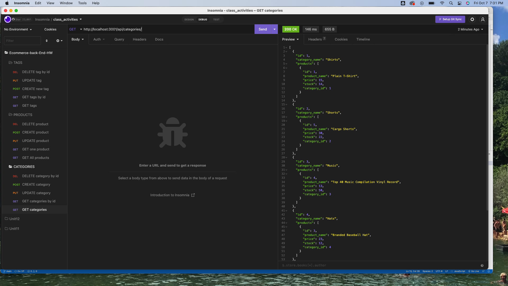
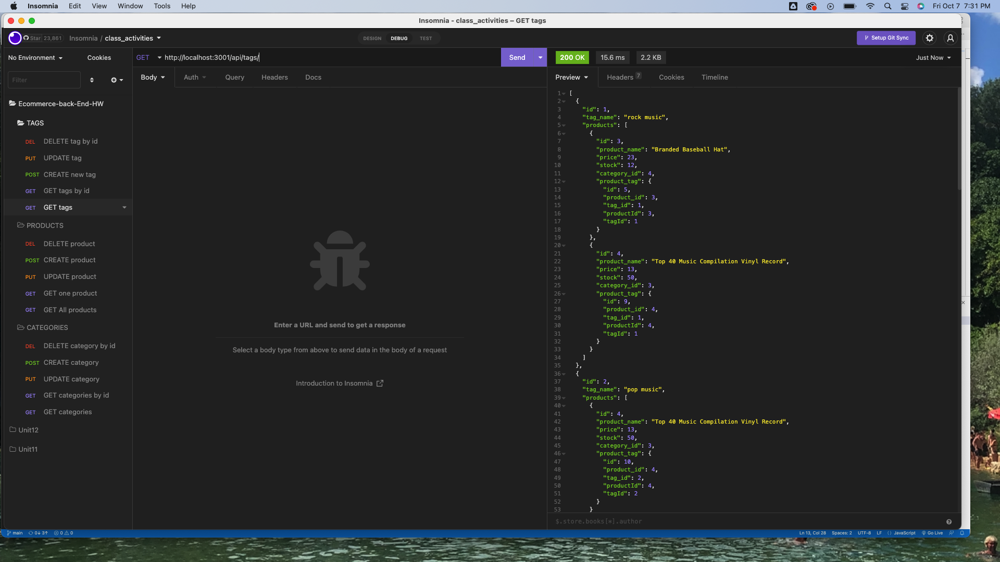

# Ecommerce-Back-End
The purpose of this project was to create the back-end of an e-commerce platform.

This application was built by configuring an Express.js API to use sequelize to interact with a MySql database.

## Usage Instructions
To use this application, follow these instructions (Note: must have mysql):

1. Clone this repository to your local machine
2. Navigate to this repository in your terminal and run npm install to install the necessary dependencies
3. To create the database, enter mysql -u root -p in your terminal and enter your password. Then in the mysql shell, enter source ./db/schema.sql
4. Exit mysql with quit
5. In your terminal run npm run seed to seed the database with starter data
6. You can then test the applications routes with a tool such as Insomnia or Postman

## Screenshot

,

## Github link
[Live-link](https://christilato.github.io/Ecommerce-Back-End/)

## Video Link
[Video-link](https://drive.google.com/file/d/1A7r3D_JZaIOFNEamx390tCMDkJ5MSqLn/view)